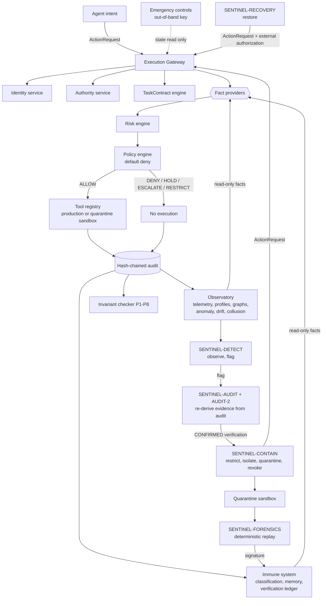

# Architecture

## 1. Position

SENTINEL is an **authority-attenuating immune architecture**, not a detector
bolted onto an agent framework. It treats agents, their relationships, their delegation chains, their
tool access, their authority and their behaviour as first-class security
objects, and it places a single enforcement boundary between agent *intent* and
agent *effect*.

```text
                ┌───────────────────┐
                │       AGENT       │
                └─────────┬─────────┘
                          │  untrusted intent
                          ▼
                ┌───────────────────┐
                │   CONTROL PLANE   │
                │  identity         │
                │  authority        │
                │  contract         │
                │  policy           │
                │  risk             │
                │  delegation       │
                └─────────┬─────────┘
                          │  authorized action
                          ▼
                ┌───────────────────┐
                │ EXECUTION GATEWAY │
                └───────────────────┘
```

Nothing above the gateway is trusted: not the system prompt, not the model's
alignment, not the agent's instructions, not the SDK. The gateway holds the only
references to tool handlers (`ais/control_plane/tools.py`), so "call the tool
directly" is not an available move for an agent.

## 1a. Data flow



Two things to read off this diagram:

* the observatory and the immune system reach the decision path **only** as fact
  providers - arrows in, no arrows out to execution;
* every defensive agent's arrow to the gateway is the same arrow an ordinary
  agent uses. There is no privileged edge.

## 2. The analysis pipeline

```text
                         AGENT ECOSYSTEM
                               │
              ┌────────────────┼────────────────┐
           Agent A          Agent B          Agent C
              └────────────────┼────────────────┘
                               ▼
                  ┌────────────────────────┐
                  │   AGENT IDENTITY GRAPH │  observatory/graph.py
                  └────────────┬───────────┘
                               ▼
                  ┌────────────────────────┐
                  │ BEHAVIORAL OBSERVATORY │  observatory/behavior.py
                  └────────────┬───────────┘
                               ▼
                  ┌────────────────────────┐
                  │ AUTHORITY DRIFT ENGINE │  observatory/drift.py
                  └────────────┬───────────┘
                               ▼
                  ┌────────────────────────┐
                  │   THREAT CLASSIFIER    │  immune_system/classification.py
                  └────────────┬───────────┘
                ┌──────────────┼──────────────┐
                ▼              ▼              ▼
             MONITOR        RESTRICT       ISOLATE      control_plane/containment.py
                └──────────────┼──────────────┘
                               ▼
                  ┌────────────────────────┐
                  │     IMMUNE MEMORY      │  immune_system/memory.py
                  └────────────┬───────────┘
                               ▼
                  ┌────────────────────────┐
                  │ ADAPTIVE POLICY ENGINE │  control_plane/policy.py + policies/
                  └────────────────────────┘
```

## 3. Request path

`ExecutionGateway.submit` runs eleven ordered steps. The order is itself a
security property: emergency controls win before authentication, authentication
wins before authority, authority wins before policy, and execution happens last.

| # | Step | Failure mode it closes |
|---|---|---|
| 1 | emergency control check | a compromised (or merely confident) system ignoring the kill switch |
| 2 | policy integrity check | in-process policy mutation |
| 3 | authentication | agent impersonation |
| 4 | namespace refusal | agents reaching policy/authority/audit/emergency surfaces |
| 5 | forbidden-capability refusal | offensive verbs entering the model at all |
| 6 | authority check | default-deny violation |
| 7 | task-contract check | acting outside declared purpose; contract tampering |
| 8 | fact assembly + risk | decisions without evidence |
| 9 | policy evaluation | ad-hoc, non-reproducible judgement |
| 10 | execution | tool access without a decision |
| 11 | telemetry + audit | unobservable actions |

Facts are contributed by read-only providers (`Observatory.fact_provider`,
`ImmuneSystem.fact_provider`). Observation therefore *informs* enforcement
without *holding* enforcement authority — Principle 4 as a wiring constraint.

Caller-supplied claims (`verification_ref`, `confidence`) are recorded as
`claimed_*` facts and are never used directly; the immune system validates them
against signed ledger records and produces `verification_valid` /
`verification_confidence`.

## 4. Control plane services (section 18 of the brief)

| Service | Module | Responsibility |
|---|---|---|
| Identity | `identity.py` | principals, credentials, impersonation detection |
| Authority | `authority.py` | grants, expiry, revocation, restrictions |
| Policy | `policy.py` | deterministic decisions over facts |
| TaskContract | `contracts.py` | declared purpose, sealing, sub-contracts |
| Behavior monitor | `observatory/` | telemetry, profiles, graphs |
| Risk | `risk.py` | explainable weighted scoring |
| Delegation | `delegation.py` | the `⊆` predicate, depth, cycles |
| Containment | `containment.py` | monitor/restrict/isolate/quarantine/revoke |
| Revocation | `revocation.py` | irreversible action with an evidence bar |
| Quarantine | `quarantine/` | sandbox, recording, deterministic replay |
| Immune memory | `immune_system/memory.py` | validated signatures |
| Audit | `audit.py` | hash-chained, searchable, replayable ledger |
| Emergency | `emergency.py` | out-of-band kill switches |

## 5. Defensive agents

```text
SENTINEL-DETECT     agent.observe, agent.flag, immune.read
SENTINEL-AUDIT      agent.observe, agent.analyze, immune.read
SENTINEL-CONTAIN    agent.restrict, agent.isolate, agent.quarantine, agent.revoke
SENTINEL-FORENSICS  agent.observe, agent.analyze, agent.replay, immune.read, immune.write
SENTINEL-RECOVERY   agent.restore
```

Each is a separate principal with a separate credential and a separate task
contract. The coordinator (`sentinel.py`) schedules the cycle but holds no
authority itself:

```text
detect → independently verify → plan → contain → (next cycle) forensics → memory
```

The separation is load-bearing. The detector cannot contain; the container
cannot observe; the auditor can neither flag nor contain; forensics cannot
restrict; recovery can only restore, and only against an external authorization
reference. A compromise of any single defensive agent yields a strict subset of
the response pipeline, never the whole of it.

## 6. Why containment decisions are two-party

`SENTINEL-DETECT` produces a classification. `SENTINEL-AUDIT` does **not** read
that classification's evidence strings; it re-derives predicates from the audit
chain (`denied_decisions`, `authority_excess`, `distinct_denied_capabilities`,
`quarantined`, `post_quarantine_attempts`) and asks whether the claimed class is
supported. Only a `CONFIRMED` verification, bound to that subject, unlocks
POL-110/111/112/124. A detector that hallucinates a threat therefore produces
nothing but an audit record.

## 7. Graduated, reversibility-ordered response

```text
MONITOR      (no authority change)        confidence ≥ 0.0
RESTRICT     (reversible suppression)     confidence ≥ 0.5
ISOLATE      (reversible, network+deleg.) confidence ≥ 0.6
QUARANTINE   (reversible, sandboxed)      confidence ≥ 0.7
REVOKE       (irreversible)               confidence ≥ 0.85 + verification
```

`ThreatClassifier._recommend` walks *down* this ladder until the confidence gate
is satisfied, so low confidence can never select an irreversible action. Policy
enforces the same gates independently, so a bug in the planner is not sufficient
to cause an irreversible action.

## 8. Quarantine

A quarantined agent is not stopped; it is re-pointed. The gateway swaps its tool
registry for a sandbox registry (synthetic datasets, fake credentials, absorbed
writes, blocked egress, in-memory filesystem) and records every call. Because
the sandbox is seeded from the environment id, the session replays byte for
byte, which is what makes a forensic signature admissible: a transcript that
does not replay deterministically yields no signature.

## 9. Audit

```text
hash_n = SHA256( canonical(record_n) || hash_{n-1} )
```

Mutation, reordering and truncation are all detectable
(`tests/unit/test_policy_and_audit.py`, `tests/adversarial` case 20). Records are
searchable by actor, subject, task and type, and `replay()` yields decision
bodies for forensic reconstruction.

## 10. Cross-agent analysis

Single-agent profiling cannot see a threat that has been split across two
agents. `observatory/collusion.py` looks for ordered
**acquire → transfer → exfiltrate** chains spanning a pair, within a window,
and weights them by *capability complementarity*: neither agent could perform
the whole chain with its own authority.

The response is deliberately not containment. Neither agent exceeded its grant,
so `POL-060-COLLUSION-ESCALATION` returns `ESCALATE` for the implicated steps:
the chain stops and a human is asked, while both agents keep their authority.
SENTINEL-AUDIT re-derives the same chain from the audit chain
(`reconstruct_collusion`), so the finding is corroborable, and a
HOLD/ESCALATE decision is explicitly *not* counted as an agent violation -
otherwise escalation would manufacture its own evidence.

## 10a. Cross-process verification

The in-process auditors are *logically* independent: they read only the audit
chain. `ais/verifier/` makes the separation **physical**.

```text
control-plane process                     verifier process
─────────────────────                     ────────────────
SENTINEL-AUDIT-REMOTE                     python -m ais.verifier.service
  export_records(audit) ──── signed ────▶  verify_chain(records)
  head hash                  request       derive_authority(records)
                                           predicates(records, subject)
                                           supports(claim, predicates)
  record_remote(verdict) ◀─── signed ────  verdict + chain head + pid
                             response
```

What the child process has: a serialised audit chain and a claim. What it does
not have: the authority service, the observatory, the policy engine, a gateway,
or any way to act on the ecosystem. It recomputes the hash chain before reading
a single claim, and derives the subject's grants, revocations and restrictions
from `authority.*` events rather than being told them.

Four properties follow, each tested:

| Property | Mechanism |
|---|---|
| a doctored history cannot buy a confirmation | the child recomputes every record hash → `REJECTED` |
| a lie about the history cannot either | the caller's claimed head must equal the computed head → `REJECTED` |
| a verdict cannot be forged by the caller | responses are HMAC-signed with operator-established key material that never passes through a gateway request |
| losing the verifier loses containment, never gains it | no verdict → POL-110/111/112 stay at HOLD, and `verification.unavailable` is audited |

A crash is survivable: the client respawns the child, which re-derives
everything from the chain, so respawning cannot launder a claim (tested).

The reconstruction logic (`ais/verifier/reconstruction.py`) is shared verbatim
with the in-process auditor. One implementation, two transports - which is what
makes "the same evidence, derived independently" checkable rather than two
implementations that happen to agree.

Cost on this machine: ~10 ms per verification round trip for a 124-record chain,
against ~2.7 ms for the same reconstruction in-process. The gap is process
boundary plus chain transfer; the chain is exported once per audit length and
reused across subjects in a cycle.

## 11. Multi-party attestation

Revocation - the only irreversible action - requires **two independent
verifiers** (`POL-110`, fact `verification_count >= 2`). SENTINEL-AUDIT and
SENTINEL-AUDIT-2 are separate principals with separate credentials running the
same reconstruction independently; with `remote_verification=True`,
SENTINEL-AUDIT-REMOTE adds a verifier in a separate OS process, so the two
required verifiers can be in two different processes. `independent_verifiers()` counts distinct
principals, so one auditor repeating itself remains one opinion. Compromising a
single verifier therefore buys a HOLD, not an irreversible action.

## 12. Context-bound authority

A grant may carry `scope={"task_id": ...}`. Such a grant is usable only inside
that task contract; `AuthorityService.granted/effective/has` take the request's
task id, and a context-bound grant is excluded when no task is supplied. This
narrows the blast radius of a long-lived grant to the work it was issued for.

## 13. Runtime invariant checking

`control_plane/invariants.py` re-checks P1-P8 as **state predicates** after
every gateway decision:

| Invariant | Predicate |
|---|---|
| P1 | production tool invocations ≤ production-routed ALLOW decisions |
| P2 | no grant where `granted_by == subject` |
| P3 | every derived grant is covered by its parent, with lower depth and no longer expiry |
| P4 | no defensive principal holds an operational capability |
| P5 | every containment event traces to an allowing gateway decision (or root) |
| P6 | no revoked grant is still effective |
| P7 | no ALLOW rests on `capability_not_held` outside the sandbox; the default-deny policy never allows |
| P8 | production tool calls equal production-routed ALLOW decisions |

Violations are audited (`invariant.violation`) and, with `strict=True`, raised.
This is what turns each principle from a property of one code path into a
continuously monitored property of the whole system - and it is what detects an
in-process bypass of the gateway, which no policy can prevent.

## 14. Trace and review tooling

`observatory/trace.py` renders a run three ways: a JSON timeline, Graphviz DOT
of the identity/delegation graph, and a single self-contained HTML report with
the decision timeline, authority events, containment, drift per agent and
collusion chains. `ActionResult.narrative()` renders one decision as a sentence
("X was DENY for credential.read because it does not hold that capability
(policy POL-002)"). `python3 -m ais trace --scenario key --html trace.html`.

## 15. Emergency controls

`GLOBAL_STOP`, `AGENT_REVOKE`, `CAPABILITY_REVOKE`, `DELEGATION_FREEZE`,
`NETWORK_ISOLATE`, `QUARANTINE_ALL` are **not capabilities**. There is no grant
that reaches them and no policy that enables them; they are operated by a holder
of an out-of-band key, and the gateway may only *read* their state. The
`emergency.*` namespace is refused at gateway step 4, so no agent — defensive or
otherwise — can address them at all.
